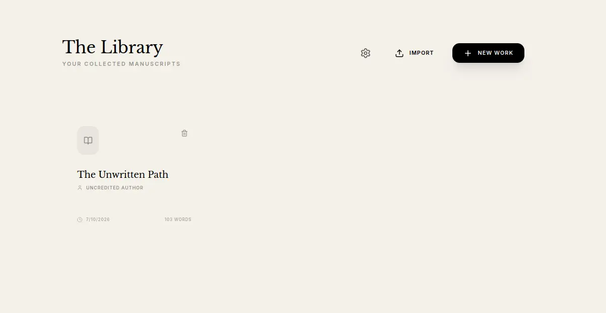
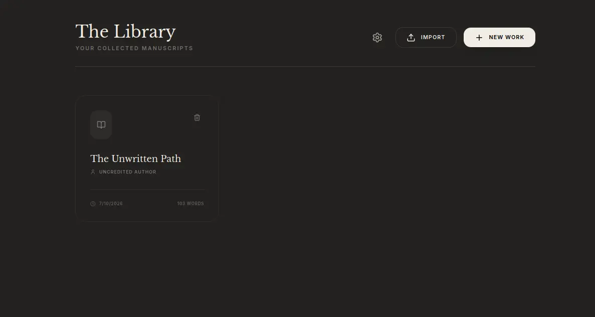
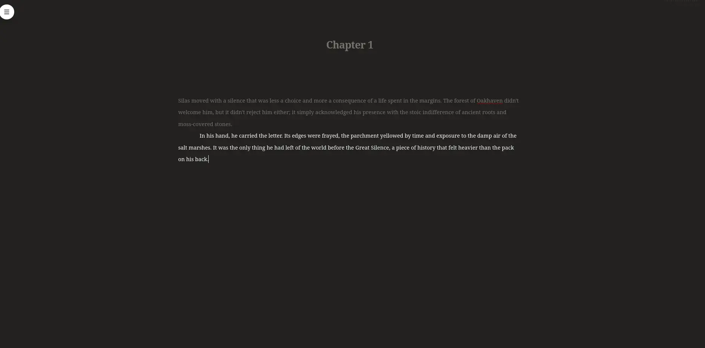

# Chronicler

[Chronicler](https://chronicler.ink) is a focused, self-hosted manuscript
workstation. It combines a distraction-free TipTap editor with a
multi-manuscript library, revision-aware sync, collaboration, exports, plugins,
and an authoritative SQLite store in a small Go container.

This repository is the maintained successor to Chronicle. Some durable internal
environment-variable and database names retain `chronicle` for backward
compatibility, while the application, repository, and published image are
Chronicler.

## Screenshots

**The Library** — manuscripts in light and dark mode:

<p align="center">
  
  
</p>

**The writing space** — a distraction-free editor with focus dimming:

<p align="center">
  
</p>

These screenshots remain representative of the current interface. The archived
Export screenshot was intentionally not carried forward because it showed the
removed built-in Outline tab.

## What it does

- Manages multiple manuscripts, chapters, metadata, author profiles, and cover
  art.
- Provides a responsive manuscript editor with smart typography, comments,
  focus mode, and a formatting-only Bold/Italic/Underline selection toolbar.
- Imports existing work and exports DOCX, Markdown, HTML, and EPUB3. Global
  Config also exports/imports the complete manuscript library as a portable,
  collision-safe, compressed `.chron` archive.
- Supports revision-aware synchronization and opt-in real-time collaboration.
- Includes local spelling and grammar infrastructure, a custom dictionary, and
  a guided proofreading workflow.
- Supports API v4 plugins installed from Git repositories, with dependency,
  conflict, update, and pinning controls.
- Offers `none`, shared-token, forward-auth, and OIDC authentication modes.
- Keeps SQLite authoritative while optionally replicating portable recovery
  records asynchronously to S3-compatible storage.
- Ships as a static Go server with the React application embedded in the
  binary. The accepted production container uses roughly 114–120 MiB on the
  validation host.

## Lean-core boundary

Chronicler deliberately does **not** ship Outliner, Issues, Thesaurus, Tense
Check, Autocomplete, Autocorrect, or live inline Grammar Check features in the
normal editor. Their final Chronicle implementations are preserved in separate
plugin repositories for future ports; several are archive placeholders and are
not yet installable.

The grammar service and `/api/grammar/check` remain available for the
Proofreader and compatible plugins. Existing documents retain legacy schema
support, and obsolete settings are ignored without destructively rewriting user
data.

## Portable manuscript archives

Global Config can download every manuscript and its cover art as a `.chron`
archive, then add that library to another Chronicler account. The format is a
versioned file hierarchy using balanced ZIP Deflate rather than a raw SQLite
copy, so it remains portable across database migrations. Import is additive and
atomic: existing records are never overwritten, internal ID collisions receive
safe new IDs, and `(Imported copy)` is added only for an actual title conflict.

The default favors normal interactive export time over XZ's maximum compression.
A representative 360,000-word regression must stay below 5 MiB before cover art;
multi-million-word libraries are supported. See [MANUSCRIPT_ARCHIVE.md](MANUSCRIPT_ARCHIVE.md)
for the format, safety limits, and the TODO for optional Zstandard, XZ, and gzip
codec plugins.

## Quick start with Docker

The public container is available from GHCR. The example uses the immutable
validated tag; production deployments can pin the displayed digest as well:

```sh
docker pull ghcr.io/vitadek/chronicler:255af2d
docker volume create chronicler-data
export CHRONICLER_TOKEN="$(openssl rand -hex 32)"
printf 'Chronicler token: %s\n' "$CHRONICLER_TOKEN"
docker run -d \
  --name chronicler \
  --restart unless-stopped \
  -p 3000:3000 \
  -v chronicler-data:/data \
  -e AUTH_MODE=token \
  -e AUTH_TOKEN="$CHRONICLER_TOKEN" \
  ghcr.io/vitadek/chronicler:255af2d
```

Open <http://localhost:3000>. Save the generated token before running the
container if you need to enter it on another device. The `/data` volume contains
the authoritative SQLite database and must be backed up.

For a Compose template, the full environment variable reference, health
checks, and maintenance commands, see [DEPLOYMENT.md](DEPLOYMENT.md),
[`deploy/ENVIRONMENT.md`](deploy/ENVIRONMENT.md), and [`deploy/`](deploy/). Production
deployments should use token, forward-auth, or OIDC mode. Anonymous non-loopback
binding fails closed unless `ALLOW_INSECURE_NO_AUTH=true` is explicitly set for
a trusted private network.

## Maintenance

The same image provides the storage and recovery CLI:

```sh
docker exec chronicler /app/chronicle-server status
docker exec chronicler /app/chronicle-server verify
docker exec chronicler /app/chronicle-server retry
docker exec chronicler /app/chronicle-server backup
```

Restore applies offline. Stop the application, review the dry run, and require
`--apply --force` before overwriting existing records. The CLI creates a hot
SQLite backup before applying a restore. See [DEPLOYMENT.md](DEPLOYMENT.md) for
the complete sequence.

## Development

The frontend uses Node 22; the server uses Go 1.25 with vendored dependencies.

```sh
cd frontend
npm ci
npm run lint
npm test
npm run build

cd ..
go test ./...
go run -tags headless .
```

The complete release gate treats the OCI image as the product boundary:

```sh
CHRONICLE_IMAGE=chronicler:local ./tests/formal/run.sh
```

It covers fail-closed configuration, manuscript and settings isolation, sync,
collaboration, S3 outage/recovery, backup, restart durability, offline restore,
and deep replica verification. The validated application release passed all 98
cases.

## Current validated application release

- Image tag: `ghcr.io/vitadek/chronicler:255af2d`
- Application commit: `255af2d35e362e2bfe34286d85a1ad9de2029f2d`
- Accepted OCI digest:
  `sha256:dcde4edd74e82a22796ccc50e11d341768b651727cd06401cf77d9252cb16e93`
- Canonical source: [GitHub](https://github.com/Vitadek/chronicler)

The original Chronicle repositories remain archived as read-only history and
rollback references.
